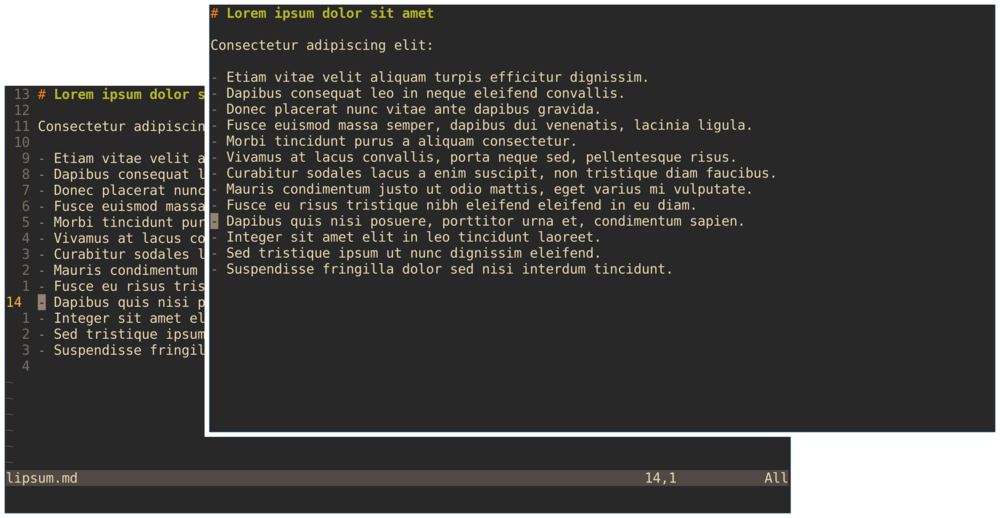

# vim-minimal-look

This plugin lets you toggle the visibility of the following UI elements:

- status line ([`laststatus`](https://neovim.io/doc/user/options.html#'laststatus'))
- mode indicator ([`showmode`](https://neovim.io/doc/user/options.html#'showmode'))
- cursor position indicator ([`ruler`](https://neovim.io/doc/user/options.html#'ruler'))
- command indicator ([`showcmd`](https://neovim.io/doc/user/options.html#'showcmd'))
- line numbers ([`number`](https://neovim.io/doc/user/options.html#'number'))
- relative line numbers ([`relativenumber`](https://neovim.io/doc/user/options.html#'relativenumber'))
- empty line indicator ([`fillchars`](https://neovim.io/doc/user/options.html#'fillchars'))



By default, the plugin binds `<Leader>M`.
When you activate it, it remembers your settings, so your customizations will be restored after deactivation.
You can override the default keybinding in your `.vimrc` or `init.vim`:

```vim
let g:minimal_look_no_mappings = v:true

" If you prefer `gM` instead of `<Leader>M`:
nmap <silent> gM <Plug>ToggleMinimalLook
```

Or in your `init.lua`:

```lua
vim.g.minimal_look_no_mappings = true

vim.keymap.set('n', 'gM', '<Plug>ToggleMinimalLook', { silent = true })
```

## Installation

Use your Vim package manager, or install it manually in Vim:

```
$ mkdir -p ~/.vim/pack/gn0/start
$ cd ~/.vim/pack/gn0/start
$ git clone https://github.com/gn0/vim-minimal-look.git
```

Or in Neovim:

```
$ mkdir -p ~/.config/nvim/pack/gn0/start
$ cd ~/.config/nvim/pack/gn0/start
$ git clone https://github.com/gn0/vim-minimal-look.git
```

## License

vim-minimal-look is distributed under [CC0](https://creativecommons.org/public-domain/cc0/).

